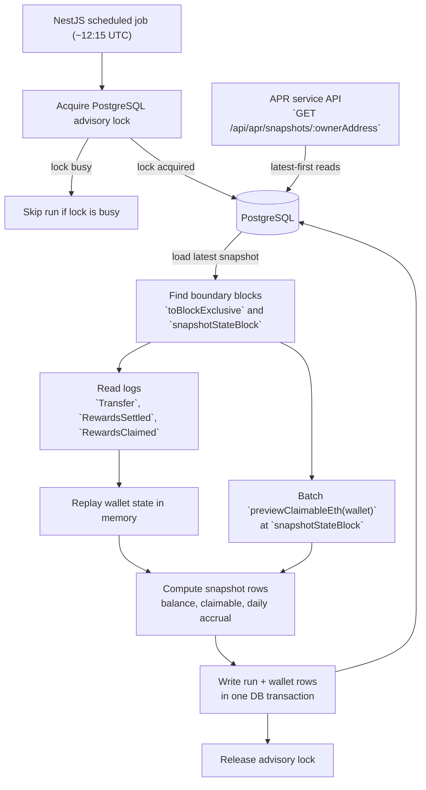

# cSSV Daily Snapshot Architecture

## Goal

Produce one daily snapshot at **12:00:00 UTC** with:

- wallet address
- total SSV staked
- daily reward accrual in ETH

For precision, ETH values should be stored in **wei**. They are still ETH-denominated values.

---

## Final Architecture

Keep v1 simple:

- **`ssv-staking-apr-service`** owns both the writer and the read endpoint
- **PostgreSQL** is canonical store
- **2 tables only**
- **no Redis**
- **no Elasticsearch**
- **no pointer table**
- **no APR calculation logic** as part of this feature
- **one NestJS scheduled job** inside the existing service
- **one PostgreSQL advisory lock** to prevent concurrent runs across overlapping pods/processes

The scheduled job should run around **12:15 UTC**.

The snapshot boundary is still exactly **12:00:00 UTC**. The job only reads logs and state up to the noon boundary, not up to execution time. The 10-minute stability delay is only there to reduce reorg risk and avoid racing very recent blocks.

Because the service is deployed as a normal Kubernetes `Deployment`, `replicaCount: 1` is **not** a strong enough exclusivity guarantee by itself. Rolling updates or temporary pod overlap can still start the scheduler twice. The job must therefore acquire a PostgreSQL advisory lock before doing any work.

Use TypeORM migrations for schema management, but prefer **query runner / raw SQL / bulk insert** for the wallet snapshot write path. This job is write-heavy enough that row-by-row ORM `save()` calls are the wrong default.

High-level flow:



The committed v1 flow is:

1. acquire advisory lock
2. load previous snapshot from PostgreSQL
3. find current day `toBlockExclusive` and derive `snapshotStateBlock = toBlockExclusive - 1`
4. read logs in `[fromBlockInclusive, toBlockExclusive)`
5. update wallet balances / claim totals in memory
6. call `previewClaimableEth(wallet)` at `snapshotStateBlock` for each relevant wallet
7. compute daily reward accrual
8. write new snapshot to PostgreSQL in one transaction
9. release advisory lock

Normalize all wallet addresses to canonical EIP-55 checksum form before storing or exposing them.

For internal map/set keys, prefer the canonical 20-byte address value or the canonical checksummed string produced from it.

On startup, the service backfills from a configured **snapshot start block** until the latest eligible `12:00 UTC` snapshot.

**Edit note (April 23, 2026):** on mainnet, the effective start point for snapshot reads is the **smart contract upgrade block `24920727`**, not raw cSSV deployment. Historical `SSVNetworkViews.totalStaked()` reverts before that block.

We explicitly checked whether any cSSV transfer history exists before the upgrade boundary:

- direct RPC log scan found **zero** `CSSVToken.Transfer` logs in `[24719189, 24920726]`
- manual Etherscan inspection shows the **first observed `Transfer` event** at block `24921023`

So starting snapshots at the upgrade block does **not** lose any snapshot-relevant token transfer history.

---

## Advisory Lock Strategy

Use a **session-level PostgreSQL advisory lock** on a **dedicated DB connection** for the entire duration of the job.

Recommended flow:

1. create a dedicated TypeORM `QueryRunner`
2. connect it
3. call `select pg_try_advisory_lock($1, $2)`
4. if lock is not acquired, log and exit
5. keep that connection open for the full job
6. on completion, call `pg_advisory_unlock($1, $2)`
7. release the `QueryRunner`

Why this is the right tool:

- cluster-wide across all service instances using the same DB
- no extra lock table needed
- survives rollbacks
- released automatically if the process or DB connection dies
- prevents duplicate job execution before expensive RPC/log replay work begins

Recommended lock key shape:

```sql
select pg_try_advisory_lock(42001, 1);
```

Example meaning:

- `42001` = application/job namespace
- `1` = cSSV snapshot job on this database/network

If the same DB ever serves multiple networks, use a different second key per network.

Important notes:

- do **not** rely on `SERIALIZABLE` transaction isolation as the primary concurrency guard
- do **not** hold one giant SQL transaction open during RPC/log replay just to keep exclusivity
- do **not** acquire the lock on a pooled connection and then let that connection go

Use a normal short DB transaction only for the final write.

Keep `unique (snapshot_date)` on `cssv_snapshot_runs` as a secondary safety net.

---

## Contract Findings

Relevant contracts:

- `ssv-network/contracts/token/CSSVToken.sol`
- `ssv-network/contracts/modules/SSVStaking.sol`
- `ssv-network/contracts/modules/SSVViews.sol`
- `ssv-network/contracts/SSVNetworkViews.sol`

### 1. Staked balance source

- `totalStaked()` = `cSSV.totalSupply()`
- `stakedBalanceOf(user)` = `cSSV.balanceOf(user)`

So wallet stake balances come from `CSSVToken.Transfer` logs.

### 2. Reward source

At any block, `previewClaimableEth(user)` returns user’s current total unclaimed ETH rewards.

This already includes:

- prior accrued rewards
- new rewards since last settlement
- transfer effects
- stake / unstake effects

### 3. Why previous snapshot is needed

`previewClaimableEth(today)` alone is not “today reward”.

Example:

- yesterday 12:00 Alice had `5 ETH` claimable
- during day Alice claimed `2 ETH`
- today 12:00 Alice has `4 ETH` claimable

Then today earned reward is:

```text
4 + 2 - 5 = 1 ETH
```

There is one extra contract detail: claim can also burn tiny dust when wallet balance is zero.

So exact v1 formula is:

```text
daily_reward_accrual =
  current_preview_claimable_eth
  + claimed_in_window
  + burned_dust_in_window
  - previous_snapshot_preview_claimable_eth
```

---

## Boundary Block

Use previous day height as approximation, then refine by timestamp.

Recommended finder:

1. start from `prevSnapshotBlock + EXPECTED_BLOCKS_PER_DAY` as approximation
2. if no previous snapshot exists yet, estimate from configured snapshot start block / genesis math
3. refine with block timestamps
4. binary search to **first** block with timestamp `> 12:00:00 UTC`

Definition:

```text
toBlockExclusive(D) = first block with timestamp > D 12:00:00 UTC
```

Window:

```text
[fromBlockInclusive, toBlockExclusive)
```

RPC note:

`eth_getLogs` uses inclusive `toBlock`, so call:

```text
fromBlock = fromBlockInclusive
toBlock   = toBlockExclusive - 1
```

`EXPECTED_BLOCKS_PER_DAY` is only a search heuristic. It can stay a code constant for the target network and become configurable later if needed.

Important state-read rule:

```text
snapshotStateBlock = toBlockExclusive - 1
```

All block-tagged state reads for the snapshot must use `snapshotStateBlock`, not `toBlockExclusive`, because `eth_call` at block `N` sees post-block-`N` state.

---

## Data Model

Use 2 PostgreSQL tables.

### 1. `cssv_snapshot_runs`

One row per snapshot day.

Suggested columns:

```sql
id bigserial primary key,
snapshot_date date not null,
snapshot_time_utc timestamptz not null,
previous_snapshot_block bigint not null,
to_block_exclusive bigint not null,
snapshot_state_block bigint not null,
from_block_inclusive bigint not null,
total_staked_wei_ssv numeric(78,0) not null,
wallet_count integer not null,
created_at timestamptz not null,
updated_at timestamptz not null,
unique (snapshot_date)
```

### 2. `cssv_snapshot_wallets`

One row per wallet per snapshot day.

Suggested columns:

```sql
snapshot_run_id bigint not null references cssv_snapshot_runs(id) on delete cascade,
wallet_address text not null,
balance_wei_ssv numeric(78,0) not null,
gross_claimable_eth_wei numeric(78,0) not null,
daily_reward_accrual_wei numeric(78,0) not null,
claimed_in_window_wei numeric(78,0) not null,
burned_dust_in_window_wei numeric(78,0) not null,
created_at timestamptz not null,
updated_at timestamptz not null,
primary key (snapshot_run_id, wallet_address)
```

Latest snapshot is:

```sql
select *
from cssv_snapshot_runs
order by snapshot_date desc
limit 1;
```

Recommended index:

```sql
create index cssv_snapshot_wallets_wallet_idx
on cssv_snapshot_wallets (wallet_address);
```

`unique (snapshot_date)` already gives PostgreSQL an index it can use for latest-run lookup, so no extra latest-run index is needed in v1.

---

## In-Memory Replay

“Replay in memory” only means:

- load previous snapshot rows into a service-level in-memory map
- update that map while processing current day
- discard map after current run finishes

No extra datastore. No long-lived mutable state.

Suggested shape:

```ts
type WalletState = {
  address: string;
  balanceWeiSsv: bigint;
  previousGrossClaimableWei: bigint;
  claimedInWindowWei: bigint;
  burnedDustInWindowWei: bigint;
};
```

This is enough for v1.

`address` should always be stored in canonical checksum form.

---

## Events To Read

For v1, read only:

- `CSSVToken.Transfer(address from, address to, uint256 amount)`
- `SSVStaking.RewardsSettled(address user, uint256 pending, uint256 accrued, uint256 userIndex)`
- `SSVStaking.RewardsClaimed(address user, uint256 amount)`

Why enough:

- `Transfer` updates balances and tells us about newly touched wallets
- `RewardsClaimed` tells us what was already paid during current window
- `RewardsSettled` gives exact `claimable_before_claim` inside claim tx
- `previewClaimableEth(wallet)` at `snapshotStateBlock` gives final current claimable value

This means v1 does **not** need to reproduce the low-level reward formula from global protocol variables such as `accEthPerShare`, `getNetworkEarnings`, or `stakingEthPoolBalance`.

---

## Daily Algorithm

### 1. Find previous snapshot

Query latest row from `cssv_snapshot_runs`.

If none exists:

- start from configured snapshot start block
- first snapshot day is first eligible `12:00 UTC` boundary after deployment

### 2. Backfill loop

On every service startup and on every scheduled tick:

1. load latest snapshot
2. compute next missing snapshot day
3. if that day’s noon boundary is already old enough to be considered stable, process it
4. continue until caught up

For the current day, in practice that means only processing it once the scheduled job runs at about `12:15 UTC`.

Same code path for:

- first bootstrap
- crash recovery
- normal daily operation

### 3. Load previous wallet snapshot

Load all wallet rows for previous snapshot into memory map.

This gives per wallet:

- yesterday balance
- yesterday total preview claimable

### 4. Read logs for current window

Read logs in `[fromBlockInclusive, toBlockExclusive)`.

Sort by:

```text
(blockNumber, transactionIndex, logIndex)
```

Do not issue one giant `eth_getLogs` request for the whole day.

Chunk requests by block range according to provider limits, for example:

- `LOG_CHUNK_SIZE_BLOCKS = 2000`

Then accumulate and globally sort the combined result set.

### 5. Apply `Transfer`

For each `Transfer(from, to, amount)`:

- if `from != 0x0`, subtract `amount` from `from` balance
- if `to != 0x0`, add `amount` to `to` balance

Also create wallet state if `from` or `to` was not in previous snapshot.

This covers:

- stake mint
- unstake burn
- user-to-user transfer

### 6. Apply claim events

For each claim tx:

1. read `RewardsSettled(user, _, accrued, _)`
2. read `RewardsClaimed(user, payout)`
3. use current in-memory wallet balance at claim moment

Then:

- `claimed_in_window_wei += payout`

Compute:

```text
remainder = accrued - payout
```

If `balance_at_claim == 0` and `remainder > 0`, then:

```text
burned_dust = remainder
```

Else:

```text
burned_dust = 0
```

Then:

- `burned_dust_in_window_wei += burned_dust`

This matches smart contract accounting exactly.

Important rule:

- pair `RewardsSettled` and `RewardsClaimed` by `transactionHash + user`, but if the same tx emits multiple settles for that user, pair the claim with the **latest preceding** `RewardsSettled` in `(blockNumber, transactionIndex, logIndex)` order

Reason:

- `RewardsSettled` also fires on stake / unstake / transfer flows
- a same-tx combined flow such as `claimEthRewards()` followed by `requestUnstake()` can emit:
  - `RewardsSettled(user, ..., accrued_before_claim, ...)`
  - `RewardsClaimed(user, payout)`
  - `RewardsSettled(user, ..., accrued_after_claim, ...)`
- in that case, the claim must pair with the first settle above, not the later post-claim settle
- for v1, standalone `RewardsSettled` events that are **not** paired with `RewardsClaimed` in the same `transactionHash + user` should be ignored
- only the paired claim path is needed for exact dust accounting

**Edit note (April 24, 2026):** implementation now follows this stricter pairing rule. A plain “last settle in tx wins” approach is incorrect for same-tx claim plus another settle-causing operation.

### 7. Build wallet query set

Set:

```text
fromBlockInclusive = previousSnapshotBlock
toBlockExclusive = current day boundary block
snapshotStateBlock = toBlockExclusive - 1
```

Query `previewClaimableEth(wallet)` at `snapshotStateBlock` for:

- every wallet from previous snapshot
- every wallet touched by `Transfer`
- every wallet in `RewardsClaimed`
- every wallet in paired `RewardsSettled`

This avoids scanning all addresses on chain.

Use JSON-RPC batch requests for these per-wallet calls.

Multicall is optional optimization only. Target contract does **not** need built-in multicall support, but chain must have a known deployed multicall contract if you want to use that pattern. There is no need to depend on multicall for v1.

### 8. Compute snapshot rows

For each wallet in query set:

```text
current_preview = previewClaimableEth(wallet) at snapshotStateBlock
previous_preview = previous snapshot gross_claimable_eth_wei, default 0
claimed_today = claimed_in_window_wei, default 0
burned_dust_today = burned_dust_in_window_wei, default 0

daily_reward_accrual =
  current_preview
  + claimed_today
  + burned_dust_today
  - previous_preview
```

Store:

- `wallet_address`
- `balance_wei_ssv`
- `gross_claimable_eth_wei = current_preview`
- `daily_reward_accrual_wei`
- `claimed_in_window_wei`
- `burned_dust_in_window_wei`

### 9. Store run

Write snapshot data inside one PostgreSQL transaction:

1. insert `cssv_snapshot_runs`
2. bulk insert `cssv_snapshot_wallets`
3. commit

If transaction fails, rerun same day safely.

For startup backfill and large snapshots, prefer query runner batch insert or raw SQL over one-row-at-a-time ORM writes.

---

## Which Wallets To Persist

Persist wallet row if any is true:

- `balance_wei_ssv > 0`
- `gross_claimable_eth_wei > 0`
- `claimed_in_window_wei > 0`
- `burned_dust_in_window_wei > 0`
- `daily_reward_accrual_wei != 0`

Reason:

- keeps next day seed small
- still keeps wallets that claimed during day
- still keeps wallets with zero balance but remaining claimable rewards
- still keeps wallets where tiny dust was burned during claim
- still keeps a terminal history row when a wallet ends the day at zero state but its daily accrual is non-zero

**Edit note (April 23, 2026):** the implemented behavior intentionally keeps rows where the end-of-day state is zero but `daily_reward_accrual_wei != 0`, so the API preserves that wallet's last meaningful accrual day instead of silently dropping it.

If all 5 fields above are zero, wallet can be omitted from snapshot.

`burned_dust_in_window_wei` is kept so the stored daily accrual stays exactly aligned with contract accounting. It is not needed to derive the next day’s seed state, but it is useful to explain why:

```text
daily_reward_accrual =
  current_preview
  + claimed_today
  + burned_dust_today
  - previous_preview
```

The bound below is **per affected claim**, not per wallet/day total.

Expected bound per affected claim:

```text
0 <= burned_dust < 100000 wei
```

---

## Recovery Story

If job crashes:

- read latest snapshot from PostgreSQL
- rebuild in-memory map from those rows
- rerun next missing day

If a bad day must be repaired:

- delete the affected snapshot day and all later days
- rerun backfill from the last known-good snapshot

---

## Validation

Implemented behavior:

- run validation asynchronously after snapshot commit
- do **not** block the write path on validation completion
- emit warn logs only; validation is not a publish gate
- skip validation for structurally empty bootstrap-era snapshots:
  - `wallet_count = 0`
  - `total_staked_wei_ssv = 0`

Current checks:

- `sum(wallet.balance_wei_ssv where balance > 0) == totalStaked()` using explicit RPC block tag = `snapshotStateBlock`
- sampled wallet balances match `balanceOf(wallet)` using explicit RPC block tag = `snapshotStateBlock`
- sampled wallet previews match `previewClaimableEth(wallet)` using explicit RPC block tag = `snapshotStateBlock`

Stretch follow-up still not implemented:

- sampled claim txs satisfy:

```text
claimable_before_claim = payout + burned_dust + claimable_after_claim
```

If validation fails:

- keep the committed snapshot as-is
- emit warn logs with enough context to investigate the mismatch
- include `repairFromSnapshotDate=<snapshotDate>` in mismatch logs
- treat validation as anomaly detection, not a publish gate

## RPC Resilience

The committed implementation retries transient RPC failures with exponential backoff.

Current defaults:

- max retries: `3`
- base delay: `1s`
- retry waits: `1s`, `2s`, `4s`

Applied to:

- `eth_blockNumber`
- `eth_getBlockByNumber`
- historical `eth_call`
- chunked `eth_getLogs`

For batched wallet reads, retry only the failed requests and keep successful wallet responses instead of reissuing the whole batch.

---

## API

For v1, one public read endpoint and one internal repair endpoint are enough.

- `GET /api/apr/snapshots/:ownerAddress`
- `POST /api/apr/admin/snapshots/repair`

No separate public runs endpoint is needed in v1.

### Request handling

- validate `ownerAddress` with `ethers.isAddress` or equivalent
- normalize it to canonical checksum form before querying
- query `cssv_snapshot_wallets` joined with `cssv_snapshot_runs`
- always return results with latest snapshot first: `order by snapshot_date desc`
- if the address is valid but has no saved snapshot rows, return `200` with `snapshots: []`
- if the snapshot feature is disabled for the deployment, both endpoints return `503` with an explicit human-readable message instead of `404`

Suggested optional query params:

- `limit`
- `offset`

Stretch goal query params:

- `fromDate` in `YYYY-MM-DD`
- `toDate` in `YYYY-MM-DD`

These are intentionally out of the committed v1 scope. If added later, they should filter by `snapshot_date` while still returning results in `snapshot_date desc` order.

### API field mapping

Do **not** expose internal block-boundary fields directly.

Internal DB fields:

- `from_block_inclusive`
- `to_block_exclusive`
- `snapshot_state_block`

Public API fields:

- `fromBlock = from_block_inclusive`
- `toBlock = snapshot_state_block`

This keeps the public response simple and expresses the snapshot range as an inclusive interval:

```text
[fromBlock, toBlock]
```

### Response shape

All wei-denominated values must be serialized as **JSON strings** to avoid precision loss in clients.

All fields below should be returned for every snapshot row. They are not wire-optional.

```json
{
  "ownerAddress": "0x1234567890AbCdEF1234567890abCDef12345678",
  "snapshots": [
    {
      "snapshotDate": "2026-04-15",
      "snapshotTimeUtc": "2026-04-15T12:00:00Z",
      "fromBlock": 22001000,
      "toBlock": 22008210,
      "balanceWeiSsv": "500000000000000000000",
      "dailyRewardAccrualWei": "1234500000000000",
      "grossClaimableEthWei": "9876500000000000",
      "claimedInWindowWei": "500000000000000",
      "burnedDustInWindowWei": "0"
    }
  ]
}
```

### Swagger field descriptions

Use the following descriptions in Swagger/OpenAPI.

- `ownerAddress`
  Canonical EIP-55 checksummed wallet address used for the lookup.

- `snapshotDate`
  Snapshot business date in UTC. Represents the daily `12:00:00 UTC` snapshot for that date.

- `snapshotTimeUtc`
  Exact UTC snapshot timestamp. For v1 this is always `12:00:00Z` on `snapshotDate`.

- `fromBlock`
  First included execution-layer block in the snapshot range.

- `toBlock`
  Last included execution-layer block in the snapshot range.

- `balanceWeiSsv`
  Wallet cSSV balance at the snapshot boundary, denominated in wei of SSV.

- `dailyRewardAccrualWei`
  Net ETH rewards accrued by the wallet during the snapshot block range, denominated in wei. This includes rewards still claimable at the boundary plus rewards already claimed during the window, and includes burned dust adjustments so the value stays exactly aligned with contract accounting.

- `grossClaimableEthWei`
  Total ETH rewards still claimable by the wallet at the snapshot boundary, denominated in wei.

- `claimedInWindowWei`
  ETH rewards actually paid out to the wallet during this snapshot window via `RewardsClaimed`, denominated in wei.

- `burnedDustInWindowWei`
  Tiny reward remainder removed during claim rounding when the wallet had zero cSSV balance, denominated in wei. This is an accounting field used to keep `dailyRewardAccrualWei` exactly aligned with contract behavior. Per affected claim, the burned amount is always `< 100000 wei`.

### Query shape

Representative SQL shape:

```sql
select
  w.wallet_address,
  r.snapshot_date,
  r.snapshot_time_utc,
  r.from_block_inclusive as from_block,
  r.snapshot_state_block as to_block,
  w.balance_wei_ssv,
  w.daily_reward_accrual_wei,
  w.gross_claimable_eth_wei,
  w.claimed_in_window_wei,
  w.burned_dust_in_window_wei
from cssv_snapshot_wallets w
join cssv_snapshot_runs r on r.id = w.snapshot_run_id
where w.wallet_address = $1
order by r.snapshot_date desc
limit $2 offset $3;
```

---

## Future Improvement

Current v1 calls `previewClaimableEth(wallet)` per wallet at `snapshotStateBlock`.

That is simplest and easiest to reason about.

If wallet count becomes large, future optimization:

- replace per-wallet `previewClaimableEth` calls with local formula
- call only global values once at `snapshotStateBlock`
- compute current preview in process

That local formula is:

```text
previewAcc = accEthPerShare

if totalStaked > 0 and getNetworkEarnings > stakingEthPoolBalance:
    previewAcc +=
      (getNetworkEarnings - stakingEthPoolBalance) * 1e18 / totalStaked

current_preview_claimable =
  accrued +
  balance * (previewAcc - userIndex) / 1e18
```

This is a good future optimization, but it should **not** be the v1 design because it adds complexity.

Retention is out of scope for v1. If needed later, add a simple cleanup job to delete snapshot rows older than the chosen retention window, for example 33 days.
